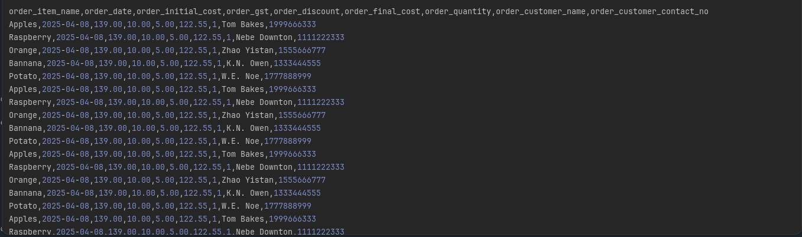
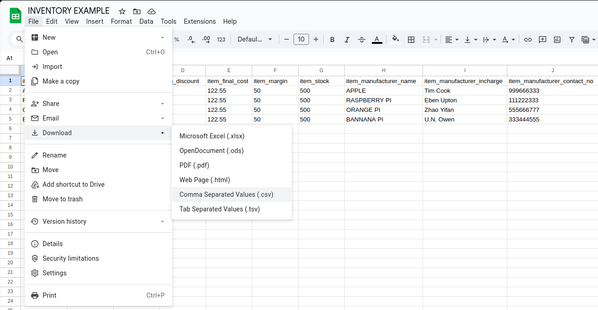
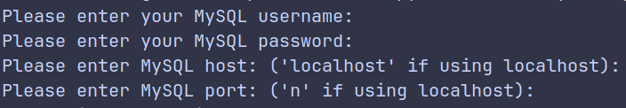
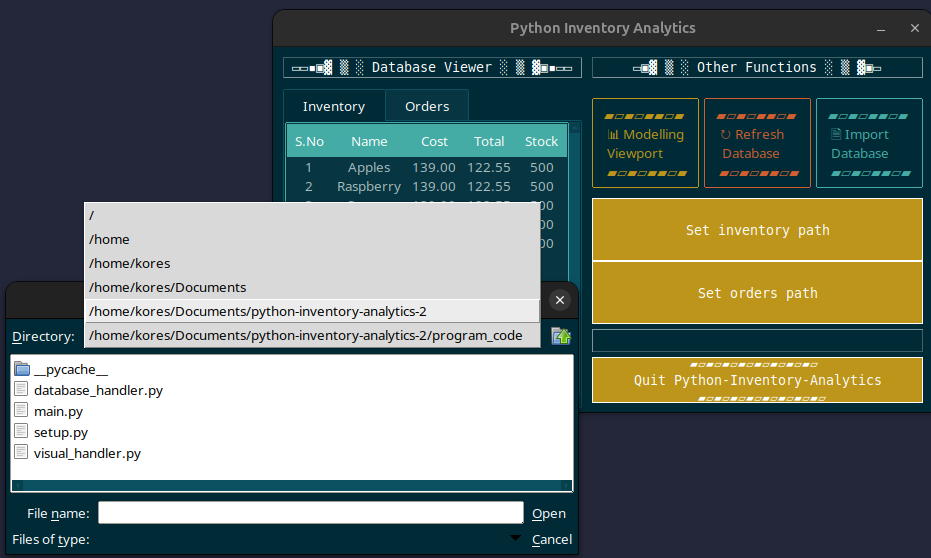
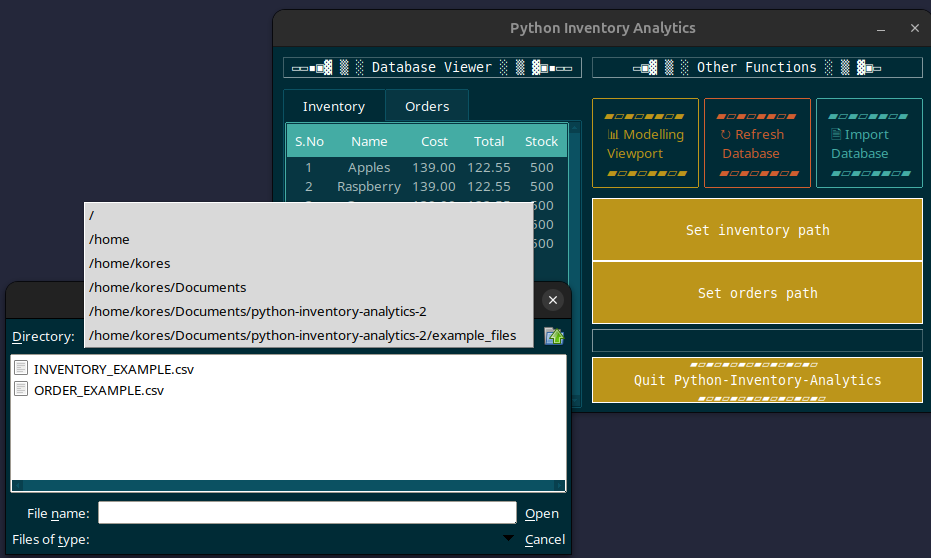
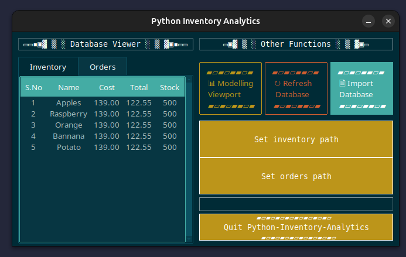
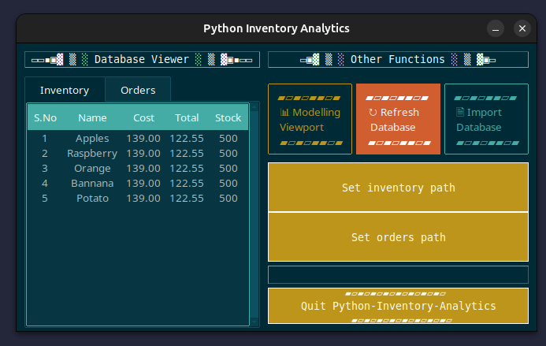
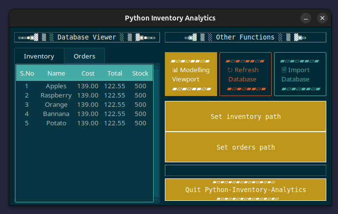

# python-inventory-analytics

An easy-to-use inventory visualisation software with a stylish dashboard for critical data insights. Designed for small to medium-sized businesses or for personal inventory tracking.


> ⚠️ Note: Not compatible with Python 3.13 (due to an error with X11).

## Features

* *Stunning* GUI via ttkbootstrap
  
* Tracking of inventory via linking with CSV file
  
* MySQL database integration

* Visualisation of trends using 3D and 2D plotter

* Compute basic analytics (e.g, most sold items, restock alerts)
  

## Libraries Used

All libraries are installable via pip3:

* matplotlib: for plotting of input data
```
pip3 install matplotlib
```

* numpy: for numerical operations and lightweight data analysis
```
pip3 install numpy
```
* ttkbootstrap: for styling the Tkinter GUI
```
pip3 install ttkbootstrap
```
* mysql-connector-python: for MySQL database interaction
```
pip3 install mysql-connector-python
```

## Getting Started
1. [Clone the Repository](https://docs.github.com/en/repositories/creating-and-managing-repositories/cloning-a-repository)

2. [Install MySQL](https://dev.mysql.com/downloads/)

3. Create Inventory and Orders Table
      * Via Spreadsheet
      <br></br>
      This is what the Inventory Table should look like 
      ⚠ ONLY FIRST ROW MUST BE EXACTLY THE SAME IN YOURS
      
      This is what the Orders Table should look like 
      ⚠ ONLY FIRST ROW MUST BE EXACTLY THE SAME IN YOURS
      
      * Via CSV
      <br></br>
      This is what the Inventory File should look like 
      ⚠ ONLY FIRST LINE MUST BE EXACTLY THE SAME IN YOURS
      
      This is what the Orders File should look like 
      ⚠ ONLY FIRST LINE MUST BE EXACTLY THE SAME IN YOURS
      
      
4. Export As CSV
     * From Spreadsheet
     <br></br>
     
    * From CSV
     <br></br>
     Already in CSV format
5. Run main.py and enter basic details
      <br></br>
      

6. Set <inventory_table>.csv and <orders_table>.csv as path in Home-View
      <br></br>
      
      
7. Press Import Database Button  
      <br></br>
      
8. Press Refresh Button  
      <br></br>
      

9. Click Modelling View Button to switch to Modelling-View   
      <br></br>
      
     

## How to Run

Using pip, install all the required libraries from the requirements.txt file
```
pip3 install -r /path/to/requirements.txt
```

Now, simply run the main Python file from the directory of the python-inventory-analytics folder:
```
python3 main.py
```


## Project Status

This project is currently COMPLETE. 


## Contributions

Applicaions for new Contributors are closed as of this time.
##
Current Contributors:
- Pranav Bharti
- Mantra Asthana
##

## License

MIT License — see LICENSE file for details.
